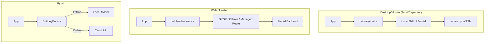

# AI Architecture: The Self-Building World

**Status**: 🟢 Production Ready  
**Core Components**: Brittney Architect / Spatial Intelligence  
**Concept**: "The game that builds itself"

---

## 1. Brittney: The AI Architect

**Brittney** is the native AI agent embedded within Hololand. She allows games to generate infinite content on the fly.

### Deployment Routes

| Tier | Package | Model | Use Case |
|------|---------|-------|----------|
| **Local** | `@hololand/brittney-toolkit` | Bundled GGUF (2GB) | Tauri apps, mobile, offline worlds, sovereign NPCs |
| **Self-hosted/BYOK** | `@hololand/inference` | Ollama, LAN, or user-supplied provider keys | Creator tools, private worlds, agent stewardship |
| **Managed** | HoloLand-hosted runtime | Hosted models behind receipts and cost ceilings | Convenience, uptime, premium scale |
| **Legacy** | `@hololand/brittney-service` | Deprecated fine-tune service | Back-compat only; not a target for new lineage work |

### Architecture



### Bundled Model (Desktop & Mobile)

Apps built with **Tauri** (desktop) or **Capacitor/React Native** (mobile) ship with a bundled Brittney model:

| Property | Value |
|----------|-------|
| **Model** | TinyLlama 1.1B (fine-tuned on HoloScript) |
| **Format** | GGUF (quantized) |
| **Size** | ~2 GB |
| **Context** | 2048 tokens |
| **Inference** | llama.cpp via WASM |

```typescript
// Tauri/Mobile app - works completely offline
import { BrittneyEngine, BUNDLED_MODEL } from '@hololand/brittney-toolkit';

const brittney = new BrittneyEngine({
  mode: 'local',
  model: BUNDLED_MODEL, // Uses bundled GGUF
});

await brittney.initialize();
const scene = await brittney.generate({ prompt: 'Medieval village' });
```

### Cloud Models (Web & Enterprise)

For web apps or enhanced capabilities, use the inference layer. Managed cloud is
a route, not the definition of Brittney:

| Model ID | Examples | Purpose |
|----------|----------|---------|
| `brittney` (V1) | 94 | HoloScript code generation |
| `brittney-v2` (V2) | 10,000 | General assistant tasks |

```typescript
// Web app - requires API key
import { CloudInference } from '@hololand/inference';

const cloud = new CloudInference({
  provider: 'openai',
  model: 'ft:gpt-4o-mini-2024-07-18:brian-x-base-llc:brittney:CztHDZP4',
  apiKey: process.env.OPENAI_API_KEY,
});
```

### Capabilities

| Feature | Description | Architecture |
|---------|-------------|--------------|
| **QuestGen** | Dynamic quest chains based on player history | Context-Aware Prompting |
| **Living NPCs** | Real-time dialogue and behavior trees | `generateNPCDialogue()` |
| **Scene Composition** | Procedural placement of assets | `generateScene()` |
| **Game Balance** | AI-tuned item stats and abilities | Differential Evolution |
| **Offline AI** | Full functionality without internet | Bundled GGUF model |
        context: gameState
    });
    
    questLog.add(quest);
};
```

### AGI Lineage Contract

Brittney is the seed intelligence pattern for HoloScript, Studio, and HoloLand.
She must not collapse into one centralized chat endpoint or a set of isolated
product bots.

Per D.040, HoloMesh teammates, HoloLand NPCs/items/encounters, and
uaa2-orchestrated services are the same kind of entity at different scales.
They should consume the HoloScript sovereign trait library:
`@verbalFingerprint`, `@autonomousAgenda`, `@reputationLedger`,
`@vocabularyRegister`, `@speechAwareEncounter`, and `@avatarIntent`.

HoloLand manifests define role, world context, privacy boundary, cost ceiling,
local/BYOK/managed routing, and receipts. HoloScript owns the trait semantics.
HoloLand turns those traits into embodied runtime behavior for guides, world
stewards, NPCs, item arcs, encounters, and creator copilots.

New Brittney descendants must therefore start from HoloScript traits and
receipted runtime manifests. Do not build new AGI surfaces as one-off
TypeScript chatbots, remote-only inference calls, or per-product assistant
identities.

---

## 2. Spatial Intelligence (AR Suite)

The **AR Suite** (`@hololand/ar-*`) gives agents "eyes" to understand the physical world.

### Components

#### A. `@hololand/ar-tracking` (The Eyes)
- **SLAM (Simultaneous Localization and Mapping)**: Tracks device position in 3D space.
- **Image Tracking**: Recognizes posters, cards, and objects.

#### B. `@hololand/ar-anchors` (The Memory)
- **Geo-Spatial Persistence**: "Remembering" where virtual objects are placed in the real world.
- **Cloud Anchors**: Sharing object positions between multiple players.

#### C. `@hololand/ar-detection` (The Brain)
- **Plane Detection**: Identifying floors, walls, and tables.
- **Object Classification**: "This is a chair", "This is a door".

---

## 3. The "Hidden Velocity" Patterns

We observed that AI agents (including Brittney herself) are building features faster than human documentation can track.

**P.AI.AUTO_DISCOVERY.01**
- **Principle**: The codebase is a living organism.
- **Practice**: Periodic filesystem scans are required to find "Dark Matter" features.
- **Evidence**: Discovery of the complete AR Suite and VRChat Compiler in `packages/`.

---

## 4. Roadmap

| Phase | Feature | Status |
|-------|---------|--------|
| **Phase 1** | Generative Content (Quests/NPCs) | ✅ Live |
| **Phase 2** | Spatial Anchoring (Shared AR) | ✅ Live |
| **Phase 3** | "Living World" (Agents modify own code) | 🟡 Beta |
| **Phase 4** | Full Autonomy (Brittney releases updates) | 🧪 Alpha |

---

## 5. Ownership Model Across HoloScript, Studio, and Hololand

Brittney spans all three layers of the ecosystem, but with different responsibilities:

- **HoloScript** provides Brittney's language, generation, and systems substrate.
- **Studio** is Brittney's primary home surface for creation, refinement, and memory accumulation.
- **Hololand** is Brittney's runtime embodiment inside live worlds and social/spatial experiences.

Short version:

- In HoloScript, Brittney is the **builder**.
- In Studio, Brittney is the **creator**.
- In Hololand, Brittney is the **embodied guide/operator**.
- In the AGI program, Brittney is the **lineage seed** consumed through
  HoloScript traits by teammates, NPCs, items, encounters, and uaa2 services.

See [Brittney Ownership Model](./docs/BRITTNEY_OWNERSHIP_MODEL.md) for the full split.
