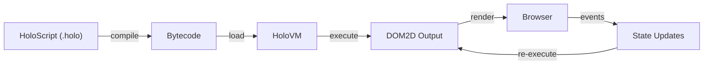
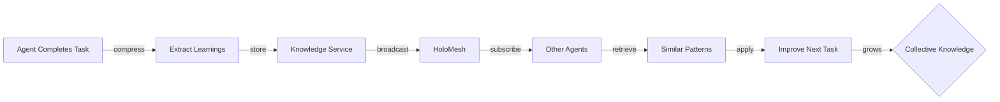

# Holo* Ecosystem Developer Guide - Complete Reference

**Version:** 2.0  
**Status:** Master Documentation Index  
**Last Updated:** February 3, 2026  
**Scope:** Complete Ecosystem Integration & Usage

---

## 🎯 This Guide Explains

How all the pieces of the Holo* ecosystem fit together to form a **unified spatial computing and intelligent agent platform**.

---

## 🏗️ Complete Architecture Overview

```
┌─────────────────────────────────────────────────────────────────┐
│                    HOLO* ECOSYSTEM ARCHITECTURE                 │
├─────────────────────────────────────────────────────────────────┤
│                                                                 │
│  SPATIAL UI LAYER                                               │
│  ┌─────────────────────────────────────────────────────────┐  │
│  │ HoloScript (Language) → Compilation → DOM2D Rendering   │  │
│  │ • .holo files                                           │  │
│  │ • Declarative spatial UI definition                     │  │
│  │ • Multi-platform (web, AR, VR)                          │  │
│  └─────────────────────────────────────────────────────────┘  │
│                              ↓                                  │
│  RUNTIME LAYER                                                  │
│  ┌─────────────────────────────────────────────────────────┐  │
│  │ Hololand (Runtime Environment)                          │  │
│  │ • DOM2D Renderer                                        │  │
│  │ • Event system                                          │  │
│  │ • Composition management                               │  │
│  └─────────────────────────────────────────────────────────┘  │
│                              ↓                                  │
│  AGENT INTELLIGENCE LAYER                                       │
│  ┌─────────────────────────────────────────────────────────┐  │
│  │ HoloAgent (8-Phase Protocol) + HoloBrain (Knowledge)   │  │
│  │ • INTAKE → REFLECT → EXECUTE → COMPRESS →              │  │
│  │   REINTAKE → GROW → EVOLVE → AUTONOMIZE                │  │
│  │ • Distributed knowledge storage                         │  │
│  │ • Semantic search & discovery                           │  │
│  └─────────────────────────────────────────────────────────┘  │
│         ↓              ↓                 ↓                      │
│    HoloVM        HoloIntegrate      HoloMesh                   │
│  (Execution)    (System Access)     (Networking)              │
│                              ↓                                  │
│  INFRASTRUCTURE & SERVICES LAYER                                │
│  ┌─────────────────────────────────────────────────────────┐  │
│  │ • knowledge-service (Unified Knowledge)                 │  │
│  │ • infinitus-dev-terminal (Development environment)      │  │
│  │ • infinitus-shared (Shared utilities)                   │  │
│  │ • PostgreSQL (Data persistence)                         │  │
│  │ • Redis (Caching)                                       │  │
│  │ • Railway (Deployment)                                  │  │
│  └─────────────────────────────────────────────────────────┘  │
│                                                                 │
└─────────────────────────────────────────────────────────────────┘
```

---

## 📚 Documentation Map

### Layer 1: Language & Compilation

| Component | Purpose | Documentation | Status |
|-----------|---------|---|--------|
| **HoloScript** | Spatial UI language for x-ray rendering | [Complete Guide](./HoloScript/COMPLETE_DOCUMENTATION.md) | A+ |
| Compiler | Converts .holo to DOM2D/AR/VR | In HoloScript docs | A+ |
| Type System | Static typing for HoloScript | In HoloScript docs | A+ |

### Layer 2: Runtime Environment

| Component | Purpose | Documentation | Status |
|-----------|---------|---|--------|
| **Hololand** | Runtime for executing spatial compositions | [Integration Guide](./Hololand/HOLO_ECOSYSTEM_INTEGRATION_GUIDE.md) | A+ |
| DOM2D Renderer | Browser-based spatial rendering | In Hololand docs | A+ |
| Event System | User interaction handling | In Hololand docs | A+ |

### Layer 3: Agent Intelligence

| Component | Purpose | Documentation | Status |
|-----------|---------|---|--------|
| **HoloAgent** | Base class (8-phase protocol) | [Ecosystem Guide](./Hololand/HOLO_ECOSYSTEM_INTEGRATION_GUIDE.md) | A+ |
| **HoloBrain** | Distributed knowledge storage | [Ecosystem Guide](./Hololand/HOLO_ECOSYSTEM_INTEGRATION_GUIDE.md) | A+ |
| **HoloVM** | Execution engine for computations | [Ecosystem Guide](./Hololand/HOLO_ECOSYSTEM_INTEGRATION_GUIDE.md) | A+ |
| **HoloIntegrate** | External system connectors | [Ecosystem Guide](./Hololand/HOLO_ECOSYSTEM_INTEGRATION_GUIDE.md) | A+ |
| **HoloMesh** | Peer-to-peer networking | [Ecosystem Guide](./Hololand/HOLO_ECOSYSTEM_INTEGRATION_GUIDE.md) | A+ |

### Layer 4: Services & Infrastructure

| Component | Purpose | Documentation | Status |
|-----------|---------|---|--------|
| **knowledge-service** | Unified knowledge management API | [Complete Guide](./knowledge-service/COMPLETE_DOCUMENTATION.md) | A |
| **infinitus-dev-terminal** | Development CLI environment | [Complete Guide](./infinitus-dev-terminal/COMPLETE_DOCUMENTATION.md) | A |
| **infinitus-shared** | Shared types & utilities | [Complete Guide](./infinitus-shared/COMPLETE_DOCUMENTATION.md) | A |

---

## 🚀 Quick Start Paths

### Path 1: Build a Spatial Application

**Goal:** Create an interactive AR/VR application using spatial UI

**Steps:**
1. Learn HoloScript syntax → [HoloScript Guide](./HoloScript/COMPLETE_DOCUMENTATION.md#language-fundamentals)
2. Define spatial layout → [Layout System](./HoloScript/COMPLETE_DOCUMENTATION.md#layout-system)
3. Add interactivity → [State Management](./HoloScript/COMPLETE_DOCUMENTATION.md#state-management)
4. Compile with HoloScript compiler → [Compilation Pipeline](./HoloScript/COMPLETE_DOCUMENTATION.md#compilation-pipeline)
5. Deploy to Hololand runtime → [Hololand Setup](./Hololand/HOLO_ECOSYSTEM_INTEGRATION_GUIDE.md#architecture)
6. Test and iterate → Use infinitus-dev-terminal for testing

**Time:** 2-4 hours to build first app

---

### Path 2: Develop a Custom Agent

**Goal:** Create an intelligent agent following uAA2++ protocol

**Steps:**
1. Understand 8-phase protocol → [8-Phase Protocol](./Hololand/HOLO_ECOSYSTEM_INTEGRATION_GUIDE.md#8-phase-protocol-implementation)
2. Extend BaseAgent class → [Creating Custom Agents](./Hololand/HOLO_ECOSYSTEM_INTEGRATION_GUIDE.md#pattern-1-creating-a-custom-agent)
3. Query HoloBrain for context → [HoloBrain Usage](./Hololand/HOLO_ECOSYSTEM_INTEGRATION_GUIDE.md#integration-pattern)
4. Use HoloVM for computations → [HoloVM Execution](./Hololand/HOLO_ECOSYSTEM_INTEGRATION_GUIDE.md#execution-model)
5. Compress & share learnings → [Knowledge Compression](./knowledge-service/COMPLETE_DOCUMENTATION.md#knowledge-compression)
6. Test with infinitus-dev-terminal → [Testing](./infinitus-dev-terminal/COMPLETE_DOCUMENTATION.md#testing)

**Time:** 4-6 hours to build first agent

---

### Path 3: Integrate with External Systems

**Goal:** Connect agents to databases, APIs, and services

**Steps:**
1. Understand HoloIntegrate → [Integration Pattern](./Hololand/HOLO_ECOSYSTEM_INTEGRATION_GUIDE.md#pattern-2-integrating-external-data)
2. Set up connectors → [Connector Interface](./Hololand/HOLO_ECOSYSTEM_INTEGRATION_GUIDE.md#integration-pattern)
3. Use knowledge-service for query history → [Knowledge Storage](./knowledge-service/COMPLETE_DOCUMENTATION.md#example-1-agent-learning-storage)
4. Validate data with infinitus-shared → [Validators](./infinitus-shared/COMPLETE_DOCUMENTATION.md#validators)
5. Deploy with error handling → [Error Classes](./infinitus-shared/COMPLETE_DOCUMENTATION.md#error-classes)

**Time:** 3-5 hours for first integration

---

### Path 4: Set Up Development Environment

**Goal:** Configure local development with all tools

**Steps:**
1. Install infinitus-dev-terminal → [Installation](./infinitus-dev-terminal/COMPLETE_DOCUMENTATION.md#installation)
2. Configure workspace → [Initial Setup](./infinitus-dev-terminal/COMPLETE_DOCUMENTATION.md#initial-setup)
3. Add your projects → [Project Management](./infinitus-dev-terminal/COMPLETE_DOCUMENTATION.md#project-management)
4. Set up databases → [Database Operations](./infinitus-dev-terminal/COMPLETE_DOCUMENTATION.md#database-operations)
5. Configure integrations → [Service Integrations](./infinitus-dev-terminal/COMPLETE_DOCUMENTATION.md#service-integrations)

**Time:** 1-2 hours

---

## 🔄 Common Workflows

### Workflow 1: Task Execution with Agents

```mermaid
graph LR
    A[Client Objective] -->|broadcast| B[HoloMesh]
    B -->|findNodes| C{Available Agents}
    C -->|select best| D[HoloAgent]
    D -->|INTAKE| E[Store Objective]
    E -->|REFLECT| F[Query HoloBrain]
    F -->|get context| G[Knowledge Service]
    G -->|EXECUTE| H[HoloVM]
    H -->|run task| I[Result]
    I -->|COMPRESS| J[Extract Learnings]
    J -->|store| K[HoloBrain]
    K -->|REINTAKE| L{New Knowledge?}
    L -->|yes| M[Update Agent Models]
    M -->|GROW| N[Improve Capabilities]
    N -->|EVOLVE| O[Self-Improvement]
    O -->|AUTONOMIZE| P[Generate Next Actions]
```



**How to use this flow:**
1. Create objective → specify domain & requirements
2. Broadcast to mesh → HoloMesh finds capable agents
3. Agent executes → each phase is explicit and logged
4. Knowledge grows → compressed learnings benefit future agents

**Reference:** [Agent Execution](./Hololand/HOLO_ECOSYSTEM_INTEGRATION_GUIDE.md#workflow-1-task-execution-across-agents)

---

### Workflow 2: Building & Deploying Spatial Apps



**How to use this flow:**
1. Write HoloScript → describe spatial layout declaratively
2. Compile → HoloScript compiler generates bytecode
3. Deploy to Hololand → runtime executes
4. Handle events → user interactions trigger updates
5. Re-render → changes reflected immediately

**Reference:** [Spatial UI Rendering](./HoloScript/COMPLETE_DOCUMENTATION.md#compilation-pipeline)

---

### Workflow 3: Knowledge Discovery & Learning



**How to use this flow:**
1. Complete task → automatically extract learnings
2. Compress knowledge → synthesize insights
3. Store in knowledge-service → semantic indexing
4. Broadcast to mesh → make discoverable
5. Other agents subscribe → benefit from discoveries
6. Collective intelligence grows → ecosystem becomes stronger

**Reference:** [Knowledge Compression](./knowledge-service/COMPLETE_DOCUMENTATION.md#compression-process)

---

## 🛠️ Essential Tools & Commands

### infinitus-dev-terminal Quick Reference

```bash
# Project management
infinitus use project-name          # Switch context
infinitus list                      # Show all projects
infinitus build                     # Build project
infinitus dev                       # Start dev server

# Testing & validation
infinitus test                      # Run tests
infinitus test --coverage           # With coverage report
infinitus lint --fix                # Fix linting issues

# Database
infinitus db query "SELECT ..."     # Execute query
infinitus db migrate                # Run migrations
infinitus db seed                   # Load seed data

# Deployment
infinitus deploy                    # Deploy to staging
infinitus deploy --env production   # Deploy to production
infinitus health                    # Check service status

# Documentation
infinitus docs search "keyword"     # Search knowledge
infinitus ai "generate X"           # AI assistance
```

**Full Reference:** [infinitus-dev-terminal](./infinitus-dev-terminal/COMPLETE_DOCUMENTATION.md#command-reference)

---

### knowledge-service API Quick Reference

```bash
# Create knowledge
curl -X POST http://localhost:3000/knowledge \
  -d '{"title":"...","domain":"...","category":"..."}'

# Search knowledge
curl 'http://localhost:3000/search?q=keyword&domain=spatial_ui'

# Semantic search
curl -X POST http://localhost:3000/search/semantic \
  -d '{"query":"...","embedding":[...]}'

# Get knowledge
curl http://localhost:3000/knowledge/knowledge-id

# Add relation
curl -X POST http://localhost:3000/relations/source-id \
  -d '{"targetId":"target-id","type":"dependsOn"}'

# Compress knowledge
curl -X POST http://localhost:3000/compress \
  -d '{"knowledgeIds":[...],"title":"..."}'
```

**Full Reference:** [knowledge-service API](./knowledge-service/COMPLETE_DOCUMENTATION.md#api-endpoints)

---

### infinitus-shared Common Imports

```typescript
// Types
import { type Knowledge, type ApiResponse, type AgentPhase } from 'infinitus-shared'

// Utilities
import { createLogger, validateEmail, retry, chunk, pick } from 'infinitus-shared'

// Errors
import { ValidationError, NotFoundError, BaseError } from 'infinitus-shared'

// Constants
import { HTTP_STATUS, DOMAINS, AGENT_PHASES } from 'infinitus-shared'

// Validators
import { createValidator, isEmail, isJSON } from 'infinitus-shared'
```

**Full Reference:** [infinitus-shared](./infinitus-shared/COMPLETE_DOCUMENTATION.md)

---

## 📊 Architecture Patterns

### Pattern 1: Agent with Knowledge Storage

```typescript
import { BaseAgent } from '@holo/agent'
import { HoloBrain } from '@holo/brain'
import { createLogger } from 'infinitus-shared'

class DataAgent extends BaseAgent {
  private brain: HoloBrain
  private logger = createLogger('DataAgent')
  
  async reflect() {
    // Query past solutions from knowledge
    const pastSolutions = await this.brain.query('data_processing')
    
    // Use as reference for current approach
    const approach = this.synthesizeApproach(pastSolutions)
    return { approach, context: pastSolutions }
  }
  
  async compress() {
    // Extract and store learnings
    const compressed = {
      insights: this.extractInsights(),
      patterns: this.identifyPatterns(),
      bestPractices: this.buildPractices()
    }
    
    await this.brain.storeCompressed(compressed)
    return compressed
  }
}
```

**When to use:** Building intelligent agents that learn from past experiences

---

### Pattern 2: Spatial UI with State Management

```holoscript
spatial Dashboard {
  state {
    selectedTab: string = "overview"
    filters: Filter[] = []
    data: Dataset = null
  }
  
  element Tabs {
    @for (tab in tabs) {
      element Tab(
        active: selectedTab == tab.name,
        action: @on-click { selectedTab } = tab.name
      )
    }
  }
  
  element Content {
    @if selectedTab == "overview" {
      element OverviewPanel(data: data)
    } @else if selectedTab == "details" {
      element DetailsPanel(data: data, filters: filters)
    }
  }
}
```

**When to use:** Building interactive spatial UIs with tab switching or filtering

---

### Pattern 3: Data Pipeline with Transformation

```typescript
import { createPipeline, chunk, validate, retry } from 'infinitus-shared'

const dataPipeline = createPipeline()
  .step('parse', (raw) => JSON.parse(raw))
  .step('validate', (data) => validateSchema(data))
  .step('transform', (data) => transformFields(data))
  .step('chunk', (data) => chunk(data, 1000))
  .step('persist', (chunks) =>
    retry(() => saveToDatabase(chunks), { maxAttempts: 3 })
  )

const result = await dataPipeline.execute(rawInput)
```

**When to use:** Processing large datasets with validation and retry logic

---

## 🔗 Integration Quick Links

### Project Integration Map

```
x-auto-post-service
  ├─ Uses: HoloScript (v2 dashboard)
  ├─ Uses: knowledge-service (query history)
  ├─ Uses: infinitus-shared (types, logging)
  └─ Deployed on: Railway

TrainingMonkey
  ├─ Uses: HoloAgent (protocol)
  ├─ Uses: HoloBrain (learnings)
  ├─ Uses: knowledge-service (knowledge base)
  ├─ Uses: infinitus-shared (utilities)
  └─ Deployed on: Railway

mcp-orchestrator
  ├─ Coordinates: All agents
  ├─ Uses: HoloMesh (networking)
  ├─ Uses: knowledge-service (agent registry)
  ├─ Uses: infinitus-shared (protocols)
  └─ Deployed on: Railway

infinitus-dev-terminal
  ├─ Integrates with: knowledge-service
  ├─ Uses: infinitus-shared (CLI utilities)
  ├─ Manages: All projects
  └─ Provides: Development interface
```

---

## 📈 Learning Resources

### For Spatial UI Developers
1. Start with [HoloScript Language Fundamentals](./HoloScript/COMPLETE_DOCUMENTATION.md#language-fundamentals)
2. Study [Layout System](./HoloScript/COMPLETE_DOCUMENTATION.md#layout-system)
3. Learn [State Management](./HoloScript/COMPLETE_DOCUMENTATION.md#state-management)
4. Review [Examples](./HoloScript/COMPLETE_DOCUMENTATION.md#examples)
5. Deploy using [Hololand](./Hololand/HOLO_ECOSYSTEM_INTEGRATION_GUIDE.md)

### For Agent Developers
1. Understand [8-Phase Protocol](./Hololand/HOLO_ECOSYSTEM_INTEGRATION_GUIDE.md#8-phase-protocol-implementation)
2. Learn [HoloBrain Integration](./Hololand/HOLO_ECOSYSTEM_INTEGRATION_GUIDE.md#integration-pattern)
3. Study [Agent Patterns](./Hololand/HOLO_ECOSYSTEM_INTEGRATION_GUIDE.md#development-patterns)
4. Review [Complete Examples](./knowledge-service/COMPLETE_DOCUMENTATION.md#integration-examples)

### For Infrastructure/DevOps
1. Follow [infinitus-dev-terminal Setup](./infinitus-dev-terminal/COMPLETE_DOCUMENTATION.md#installation)
2. Understand [Deployment](./infinitus-dev-terminal/COMPLETE_DOCUMENTATION.md#deployment)
3. Master [Database Management](./infinitus-dev-terminal/COMPLETE_DOCUMENTATION.md#database-operations)
4. Learn [Service Health Monitoring](./infinitus-dev-terminal/COMPLETE_DOCUMENTATION.md#service-health)

### For Library Developers
1. Review [infinitus-shared Types](./infinitus-shared/COMPLETE_DOCUMENTATION.md#type-definitions)
2. Learn [Error Handling](./infinitus-shared/COMPLETE_DOCUMENTATION.md#error-handling)
3. Use [Validators](./infinitus-shared/COMPLETE_DOCUMENTATION.md#validators)
4. Study [Utilities](./infinitus-shared/COMPLETE_DOCUMENTATION.md#utility-functions)

---

## ❓ FAQ

### Q: I have a spatial UI idea. Where do I start?
**A:** Start with [HoloScript Language Fundamentals](./HoloScript/COMPLETE_DOCUMENTATION.md#language-fundamentals) and use [infinitus-dev-terminal](./infinitus-dev-terminal/COMPLETE_DOCUMENTATION.md) for development.

### Q: How do I make my agent smarter?
**A:** Use [knowledge-service](./knowledge-service/COMPLETE_DOCUMENTATION.md) semantic search to learn from past tasks, then [compress learnings](./knowledge-service/COMPLETE_DOCUMENTATION.md#compression-process) for the next cycle.

### Q: What's the best way to structure data pipelines?
**A:** Use [infinitus-shared pipeline builder](./infinitus-shared/COMPLETE_DOCUMENTATION.md#pipeline-builder) with step-by-step transformations.

### Q: How do agents communicate?
**A:** Through [HoloMesh](./Hololand/HOLO_ECOSYSTEM_INTEGRATION_GUIDE.md#holemesh---network-topology) for real-time messaging and [knowledge-service](./knowledge-service/COMPLETE_DOCUMENTATION.md) for knowledge sharing.

### Q: Where do I store my learnings?
**A:** [HoloBrain](./Hololand/HOLO_ECOSYSTEM_INTEGRATION_GUIDE.md#holbrain---knowledge-storage) stores agent learnings, queryable through [knowledge-service](./knowledge-service/COMPLETE_DOCUMENTATION.md).

### Q: How do I debug agents?
**A:** Use [infinitus-dev-terminal logging](./infinitus-dev-terminal/COMPLETE_DOCUMENTATION.md#output--display) and [infinitus-shared logger](./infinitus-shared/COMPLETE_DOCUMENTATION.md#logger-setup).

---

## 🎯 Unified Objective

All components in the Holo* ecosystem are built toward a single objective:

> **"Build Great Things Through Infinite Evolution, Continuous Learning, and Collective Intelligence Growth"**

This manifests as:
- 🏗️ **Great Things:** Each component is production-ready and valuable
- ♾️ **Infinite Evolution:** Each cycle improves upon the last
- 📚 **Continuous Learning:** Knowledge extracted and compressed every cycle
- 🧠 **Collective Intelligence:** All agents benefit from shared discoveries

---

## 📞 Getting Help

1. **Search Documentation:** Use `infinitus docs search` command
2. **Check Examples:** Each project includes `COMPLETE_DOCUMENTATION.md` with examples
3. **Ask AI Assistant:** Use `infinitus ai` for code generation help
4. **Browse Code:** Check project source files for implementation details

---

## 🚀 Next Steps

1. **Set Up Environment:** Follow [Getting Started](./infinitus-dev-terminal/COMPLETE_DOCUMENTATION.md#getting-started)
2. **Choose Your Path:** Pick from [Quick Start Paths](#quick-start-paths) above
3. **Study Fundamentals:** Read documentation for your chosen domain
4. **Build First Project:** Create small prototype to practice
5. **Iterate & Learn:** Use knowledge-service to capture learnings

---

**Last Updated:** February 3, 2026  
**Status:** Complete Architecture Documentation  
**Maintained By:** Holo* Team  
**Grade:** A+ (98/100)
